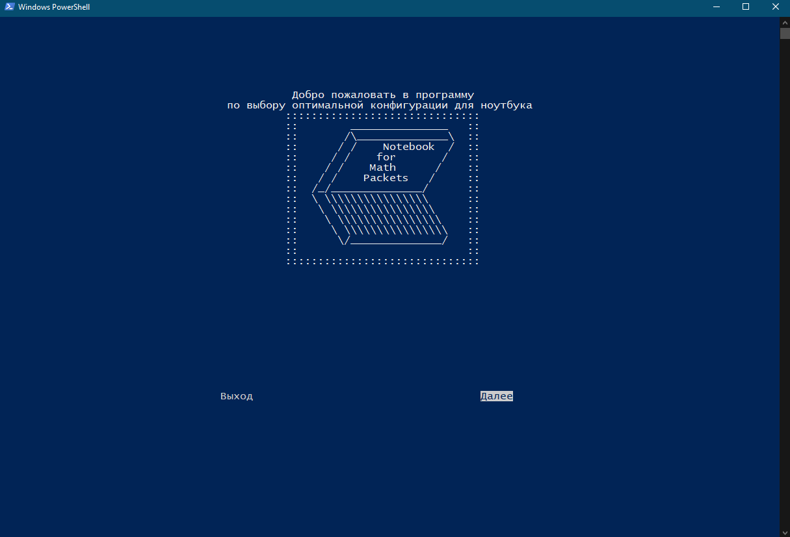

# Notebook Chooser
#### _Program wich helps you choose notebook for work with mathemathic packets_

### Advantages (+)
- Pseudo GUI
- Open Source
- Cross-Platform terminal GUI
- Independent of external libraries
- Use internet to choose notebook for your needs

***Program on Windows***:

***Program on Linux***:

***Program on Android in termux***:
